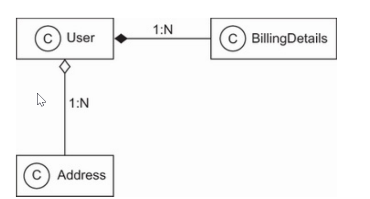

**This project covers:**
- Persisting with SQL database in Java application
- Analyzing the object/relational paradigm mismatch
- Introducing ORM, JPA, Hibernate, and Spring Data
Our focus is on using Hibernate as a provider of the Jakarta Persistence API
(formerly Java Persistence API) 

**Description**:
- SQL dialect? Should we abandon SQL completely and adopt a different database technology, such as object database systems or NoSQL systems? The debate may never end, but a solution called object/relational mapping (ORM) now has wide acceptance. 
This is due in large part to Hibernate, an open source ORM service implementation, and Spring Data, an umbrella project from Spring family whose purpose to unify and facilitate access to different kinds of persistence stores, including relational database systems and NoSQL database.
1. What is persistence?
   - Most applications require persistent data. Persistence is one of the fundamental concepts in application development. If an information system didn't preserve data when it was powered off, the system would be of little practical use. 
   - Object persistence means individual objects can outlive the application process; they can be saved to a data store and be re-created at a later point in time.
   - When we talk about persistence in Java, we're generally talking about mapping and storing object instances in a database using SQL.
     1. **Relational Databases**:
     - Relational DBMSs aren't specific to Java, nor is an SQL database specific to a particular application. This important principle is known as data independence. In other words, data usually lives longer than an application does.
     - Relational technology provides a way of sharing data among different applications, or among different parts of the same overall system (a data entry application and a reporting application, for example).
     - Relational technology is a common denominator of many disparate systems and technology platforms. Hence, the relational data model is often the foundation for the enterprise-wide representation of business entities.
     - Although marketed as relational, a database system providing only an SQL data language interface isn't really relational, and in many ways it isn't even close to the original concept. Naturally, this has led to confusion.
     - SQL practitioners blame the relational data model for shortcomings in the SQL language, and relational data management experts blame the SQL standard for being a weak implementation of the relational model and ideas.
     2. **Understanding SQL**:
     - To use JPA, Hibernate and Spring Data effectively, you must start with a solid understanding of the relational model and SQL.
     - You'll need to understand the relational model and the information model and topics such as normalization to guarantee the integrity of your data, and you'll need to use your knowledge of SQL to tune the performance of your application - these are all prerequisites for reading this book.
     - Hibernate and Spring Data simplify many repetitive coding task, but your knowledge of persistence technology must extend beyond the frameworks themselves if you want to take advantage of the full power of modern SQL database.
     - SQL is used as a data definition language (DDL), with syntax for creating, altering, and dropping artifacts such as tables and constraints in the catalog of the DBMS.
     - When this schema is ready, you can use SQL as a data manipulation language (DML) to perform operations on data, including insertions, updates and deletions.
     - You can retrieve data by executing data query language (DQL) statements with restrictions, projections and Cartesian products.
     - For efficient reporting, you can use SQL to join, aggregate, and group data as necessary.
     - You can even nest SQL statements inside each other- a technique that uses sub-selects.
     - When your business requirements change, you'll have to modify the database schema again with DDL statements after data has been stored. This is known as schema evolution.
     - You may also use SQL as a data control language (DCL) to grant and revoke access to the database or parts of it.
     3. **Using SQL in Java**:
     - When you work with an SQL database in a Java application, you issue SQL statements to the database via the Java Database Connectivity  (JDBC) API.
     - Whether the SQL was written by hand and embedded in the Java code or generated on the fly by Java code, you use the JDBC API to bind arguments when preparing query parameters, executing a query, scrolling through query results, retrieving values from a result set, and so on.
     - These are low-level data access tasks; as application engineers.
     - Are the relational data model and (especially) SQL the right choices for persistence in object-oriented applications? 
       - We can answer this question unequivocally: yes! There are many reasons why SQL databases dominate the computing industry.
       - Relational database management systems are the only proven generic data management technology, and they're almost always a requirements in Java projects.
     - Note that we aren't claiming that relational technology is always the best solution. Many data management requirements warrant a completely different approach.
       - For example, internet-scale distributed systems (web search engines, content distribution networks, peer-to-peer ...) which often need to handle high transaction volumes. These systems may use weaker consistency models and may require customer persistence solutions instead of relying on ACID-compliant systems
2. The paradigm mismatch:
   - Suppose you have to design and implement an online ecommerce application. In this application, you need a class to represent information about a user of the system, and you need another class to represent information about the user's billing details:

   - In this diagram, you can see that a User has many BillingDetails. This is a composition, indicated by the full diamond. A composition is the type of association where an object (BillingDetails) cannot conceptually exist without the container (User).
   - You can navigate the relationship between the classes in both directions; this means you can iterate through collections or call methods to get to the "other" side of the relationship.
   - The classes representing these entities may be extremely simple:
```java
//User.java
public class User {
    private String username;
    private String address;
    private Set<BillingDetails> billingDetails = new HashSet<>();
    // Constructor, accessor methods (getters/setters), business methods
}
///BillingDetails.java
public class BillingDetails {
    private String account;
    private String bankname;
    private User user;
// Constructor, accessor methods (getters/setters), business methods
}
```
- It's easy to come up with an SQL schema design for this case
```mysql
CREATE TABLE USERS (
    USERNAME VARCHAR(15) NOT NULL PRIMARY KEY,
    ADDRESS VARCHAR(255) NOT NULL
);
CREATE TABLE BILLINGDETAILS (
    ACCOUNT VARCHAR(15) NOT NULL PRIMARY KEY,
    BANKNAME VARCHAR(255) NOT NULL,
    USERNAME VARCHAR(15) NOT NULL,
    FOREIGN KEY (USERNAME) REFERENCES USERS(USERNAME)
);

```
- The foreign key-constrained column USERNAME in BILLINGDETAILS represents the relationship between the two entities.
- The object/relational mismatch is barely in evidence; it's straightforward to write JDBC code to insert, update, and delete information about users and billing details
1. The problem of granularity:
- The most obvious problem with the current implementation is that we've designed an address as a simple String value. In most systems, it's necessary to store street, city, state, country and ZIP code information separately.
- Of course, you could add these properties directly to the User class, but because other classes in the system will likely also carry address information, it makes more sense to create an Address class to reuse it.
  
- The relationship between User and Address is an aggregation, indicated by the empty diamond. Should we add an ADDRESS table?
- Not necessarily; it's common to keep address information in the USERS table. in individual columns.
- This design is likely to perform better because a table join isn't needed if you want to retrieve the user and address in a single query.
- The nicest solution may be to create a new SQL data type to represent addresses and to add a single column of that new type in the USERS table, instead of adding several new columns
- This choice of adding either several columns or a single column of a new SQL data type is a problem of granularity.
- Broadly speaking, granularity refers to the relative size of the types you're working with.
- Adding a new data type to the database catalog to store Address Java instances in a single column sounds like the best approach:
```mysql
  CREATE TABLE USERS (
  USERNAME VARCHAR(15) NOT NULL PRIMARY KEY,
  ADDRESS ADDRESS NOT NULL
  );
```
- A new Address type (class) in Java and a new ADDRESS SQL data type should guarantee interoperability. But you'll find various problems if you check on the support for user-defined data types (UDTs) in today's SQL database management systems.
- UDT support is one of several so-called object/relational extensions to tradition SQL. This term alone is confusing, because it means the database management system has ( or is supposed to support) a sophisticated data type system.
- Unfortunately, UDT support is a somewhat obscure feature of most SQL DBMSs, and it certainly isn't portable between different products. Furthermore, the SQL standard supports user-defined data types, but poorly.
- This limitation isn't the fault of the relational data model. You can consider the failure to standardize such an important piece of functionality .

**ORM, JPA, Hibernate and Spring Data
In a nutshell, object/relational mapping (ORM) is the automated (and transparent) persistence of objets in a Java application to tables in an RDBMS (relational database management system), using metadata that describes the mapping between the classes of the application and the schema of the SQL database.
In essence, ORM works by transforming (reversibly) data from one representation to another. A program using ORM will provide the meta-information about how to map the objects from the memory to the database, and the effective transformation will be fulfilled by ORM.
</br>
</br>
Some people may consider one advantage of ORM to be that it shields developers from messy SQL. This view holds that object-oriented developers shouldn't be expected to go deep into SQL or relational database.
On the contrary, Java developers must have a sufficient level of familiarity with-and appreciation- of relational modeling and SQL to work with Hibernate and Spring Data.
ORM is an advanced technique used by developers who have already one it the hard way.
</br>
</br>
JPA (Jakarta Persistence API, formerly Java Persistence API) is a specification defining an API that manages the persistence of objects and object/relational mappings.
Hibernate is the most popular implementation of this specification. So, JPA will specify what must be done to persist objects, while Hibernate will determine how to do it.
Spring Data Commons, as part of the Spring Data family, provides the core Spring framework concepts that support all Spring Data modules.
Spring Data JPA, another project from the Spring Data family, is an additional layer on top of JPA implementations (such as Hibernate).
Not only can Spring Data JPA use all the capabilities of JPA, but it adds its own capabilities, such as generating database queries from method names.
</br>
</br>
To use Hibernate effectively, you must be able to view and interpret the SQL statements it issues and understand their performance implications.
To take advantage of the benefits of Spring Data, you must be able to anticipate how the boilerplate code and the generated queries are created.
</br>
</br>
The JPA specification defines the following:
- A facility for specifying mapping metadata-how persistent classes and their properties relate to the database schema. JPA relies heavily on Java annotations in domain model classes, but you can also write mappings in XML files.
- APIs for performing basic CURD operations on instances of persistent classes, most prominently javax.persistence.EntityManager for string and loading data.
- A language and APIS for specifying queries that refer to classes and properties of classes. This language is the Jakarta Persistence Query Language (JPQL) and it looks similar to SQL. The standardized API allows for the programmatic creation of criteria queries without string manipulation.
- How the persistence engine interacts with transactional instances to perform dirty checking, association fetching, and other optimization functions. The JPA specification covers some basic caching strategies.
</br>
</br>
Hibernate implements JPA and supports all the standardized mappings, queries, and programming interfaces. Some of the benefits of Hibernate:
- Productivity - Hibernate eliminates much of the repetitive work (more than you'd expect) and lets you concentrate on the business problem. No matter which application-development strategy you prefer--top-down (starting with a domain model) or bottom-up (starting with an existing database schema)--Hibernate, used together with the appropriate tools, will significantly reduce development time.
- Maintainability- Automated ORM with Hibernate reduces lines of code, making the system more understandable and easier to refactor. Hibernate provides a buffer between the domain model and the SQL schema, isolating each model from minor changes to the other.
- Performance- Although hand-coded persistence might be faster in the same sense that assembly code can be faster than Java code, automated solutions like Hibernate allow the use of many optimizations at all time. One example is the efficient and easily tunable caching in the application tier. This means developers can spend more energy hand optimizing the few remaining real bottlenecks instead of prematurely optimizing everything.
- Vendor independence - Hibernate can help mitigate some of the risks associated with vendor lock-in. ORM tools that support several different DBMSs enable a certain level of portability. Also, DBMS independence helps in development scenarios where engineers use a lightweight local database but deploy for testing and production on a different system.
</br>
</br>
Spring Data makes the implementation of the persistence layer even more efficient. Spring Data JPA, one of the projects of the family, sits on top of the JPA layer. Spring Data JDBC, another project of the family, sits on top of JDBC. Some of the benefits  of Spring Data:
- Shared infrastructure - Spring Data Commons, part of the umbrella Spring Data project, provides a metadata model for persisting Java classes and technology-neutral repository interfaces. It provides its capabilities to the other Spring Data projects,
- Removes DAO implementations - JPA implementations use the data access object (DAO) pattern. This pattern starts with the idea of an abstract interface to a database and maps application calls to the persistence layer while hiding the details of the database. Spring Data JPA makes it possible to fully remove implementations, so the code will be shorter.
- Automatic class creation - Using Spring Data JPA, a DAO interface needs to extend the JPA-specific Repository interface - JPARepository. Spring Data JPA will automatically create an implementation for this interface-the programmer will not have to take care of this.
- Default implementations for methods - Spring Data JPA will generate default implementations for each method defined by its repository interfaces. Basic CURD operations do not need to be implemented any longer. This reduces the boilerplate code, speeds up development, and removes the possibility of introducing bugs.
- Generated queries - you may define a method on your repository interface following a naming pattern. There's no need to write your queries by hand; Spring Data JPA will parse the method name and create a query for it.
- Close to the database if needed - Spring Data JDBC can communicate directly with the database and avoid the "magic" of Spring Data JPA. It allows you to interact with the database through JDBC, but it removes the boilerplate code by using the Spring framework facilities.

**NOTE**:
- With object persistence, individual objects can outlive their application process, be saved to a data store, and be recreated later. The object/relational mismatch comes into play when the data store is an SQL-based relational database management system. For example, a network of objects can't be saved to a database table; it must be disassembled and persisted to columns of portable SQL data types. A good solution to this problem is object/relational mapping (ORM).
- ORM isn't a silver bullet for all persistence task. its job is to relive the developer about 95% of object persistence work, such as writing complex SQL statements with many table joins and copying values from JDBC result sets to objects or graphs ob objects.
- A full-featured ORM middleware solution may provide database portability, certain optimization techniques like caching, and other viable functions that aren't easy to hand-code in a limited time with SQL and JDBC. An ORM solution implies, in the Java world, the JPA specification and JPA implementation-Hibernate being the most popular nowadays.
- Spring Data may come on top of the JPA implementations, and it simplifies, even more, the data persistence process. It is an umbrella project that adheres to the Spring framework principles and comes with an even simpler approach, including removing the DAO pattern, automatic code generations, and automatic query generation.