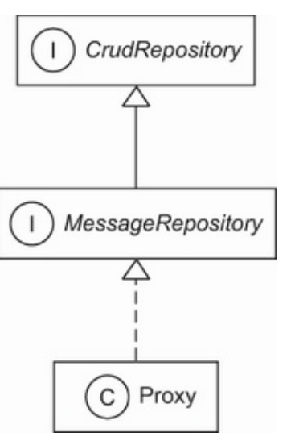

##This project covers:

- Introducing the Hibernate and Spring Data Project
- Developing a "Hello World" with Jakarta Persistence API, Hibernate and Spring Data.
- Examining the configuration and integration options.

JPA (Jakarta Persistence API, formerly Java Persistence API) is the specification defining an API that manages the
persistence of objects and object/relational mappings - it specifies what muse be done to persist objects.
Hibernate, the most popular implementation of this specification, will make the persistence happen. Spring Data makes
the implementation of the persistence layer even more efficient;it's an umbrella project that adheres to the Spring
framework principles and offers an even simple approach.

1. Introducing Hibernate</br>
   Object/relational mapping (ORM) is a programming technique for making the connection between the incompatible worlds
   of object-oriented systems and relational database. Hibernate is an ambitious project that aims to provide a complete
   solution to the problem of managing persistent data in java.
   Today, Hibernate is not only an ORM service but also a collection of data management tools extending well beyond ORM.
   The Hibernate project suite includes the following
    - The Hibernate ORM - Hibernate ORM consists of a core, a base service for persistence with SQL databases, and a
      native proprietary API. Hibernate ORM is the foundation for several of the other projects in the suite, and it's
      the oldest Hibernate project. You can use Hibernate ORM on its own, independent of any framework or any particular
      runtime environment with all JDKs. As long as a data source is accessible, you can configure it for Hibernate, and
      it works.
    - Hibernate EntityManager - This is Hibernate's implementation of standard Jakarta Persistence API. It's an optional
      module you can stack on top of Hibernate ORM. Hibernate's native features are a superset of the JPA persistence
      features in every respect.
    - Hibernate Validator - Hibernate provides the reference implementation of the Bean Validation (JSR 303)
      specification. Independent of other Hibernate projects, it provides declarative validation for domain model (or
      any other) classes.
    - Hibernate Envers- Envers is dedicated to audit logging and keeping multiple versions of data in the SQL database.
      This helps add data history and audit trails to the application, similar to any version control systems you might
      already be familiar with, such as Subversion or Git.
    - Hibernate Search - Hibernate Search keeps an index of the domain model data up to date in an Apache Lucene
      database. It lets you query this database with a powerful and natural integrated API. Many projects use Hibernate
      Search in addition to Hibernate ORM, adding full-text search capabilities. If you have a free text search form in
      your application's user interface, and you want happy users, work with Hibernate Search.
    - Hibernate OGM - This Hibernate project is an object/grid mapper. It provides JPA support for NoSQL solution,
      reusing the Hibernate core engine but persisting mapped entities into key/value-, document-, or graph-oriented
      data stores.
    - Hibernate Reactive - Hibernate Reactive is a reactive API for Hibernate ORM, interacting with a database in a
      non-block manner.
2. Introducing Spring Data</br>
   Spring Data is a family of projects belonging to the Spring framework whose purpose is to simplify access to both
   relational and NoSQL databases:
    - Spring Data Commons - Spring Data Commons, part of the umbrella Spring Data project, provides a metadata model for
      persisting Java classes and technology-neutral repository interface.
    - Spring Data JPA - Spring Data JPA deals with the implementation of JPA-based repositories. It provides improved
      support for JPA-based data access layers by reducing the boilerplate code and creating implementation for the
      repository interfaces.
    - Spring Data JDBC - Spring Data JDBC deals with the implementation of JDBC-based repositories. It provides improved
      support for JDBC-based data access layers. It does not offer a series of JPA capabilities, such as caching or lazy
      loading, resulting in a simpler and limited ORM.
    - Spring Data REST - Spring Data REST deals with exporting Spring Data repositories as RESTFull resources.
    - Spring Data MongoDB - Spring Data MongoDB - Spring Data MongoDB deals with access to the MongoDB document
      database. It replies on the repository-style data access layer and POJO programming model.
    - Spring Data Redis - Spring Data Redis deals with access to the Redis key/value database. It relies on freeing the
      developer from managing the infrastructure and providing high- and low-level abstractions for access to the data
      store.
3. "Hello World" with JPA</br>
   In the "Hello World" application, we want to store message in the database and load them from the database. Hibernate
   applications define persistent classes that are mapped to database tables. We define these classes based on our
   analysis of the business domain; hence, they're a model of the domain. This example will consist of one class and its
   mapping. We'll write the examples and executable tests, with assertions that verify the correct outcome of each
   operation.
   </br></br>
   Let's start by installing and configuring JPA, Hibernate, and the other needed dependencies.

```xml

<dependencies>
    <dependency>
        <groupId>org.hibernate</groupId>
        <artifactId>hibernate-entitymanager</artifactId>
        <version>5.6.9.Final</version>
    </dependency>
    <dependency>
        <groupId>org.junit.jupiter</groupId>
        <artifactId>junit-jupiter-engine</artifactId>
        <version>5.8.2</version>
        <scope>test</scope>
    </dependency>
    <dependency>
        <groupId>mysql</groupId>
        <artifactId>mysql-connector-java</artifactId>
        <version>8.0.29</version>
    </dependency>
</dependencies>
```

The hibernate-entitymanager module includes transitive dependencies on other modules we'll need, such as hibernate-core
and the JPA interface stubs. We also need the junit-jupiter-engine dependency to run the tests with the help of JUnit 5,
and the mysql-connector-java dependency, which is the official JDBC driver for MySQL.
</br>
</br>
Out starting point in JPA is the persistence unit. A persistence unit is a pairing of out domain model class mappings
with a database connection, plus some other mappings settings. Every application has at least one persistence unit; some
applications have several if they're talking to several (logical and physical) databases. Hence, out first step is
setting up a persistence unit in our application's configuration.
</br>

4. Configuring a persistence unit</br>
   The standard configuration file for persistence units is located on the classpath in META-INF/persistence.xml

```xml

<persistence xmlns="http://java.sun.com/xml/ns/persistence"
             xmlns:xsi="http://www.w3.org/2001/XMLSchema-instance"
             xsi:schemaLocation="http://java.sun.com/xml/ns/persistence http://java.sun.com/xml/ns/persistence/persistence_2_0.xsd"
             version="2.0">
    <persistence-unit name="ch02">
        <provider>org.hibernate.jpa.HibernatePersistenceProvider</provider>
        <properties>
            <property name="javax.persistence.jdbc.driver"
                      value="com.mysql.cj.jdbc.Driver"/>
            <property name="javax.persistence.jdbc.url"
                      value="jdbc:mysql://localhost:3306/springdataandhibernate?serverTimezone=UTC "/>
            <property name="javax.persistence.jdbc.user" value="root"/>
            <property name="javax.persistence.jdbc.password" value=""/>
            <property name="hibernate.dialect"
                      value="org.hibernate.dialect.MySQL8Dialect"/>
            <property name="hibernate.show_sql" value="true"/>
            <property name="hibernate.format_sql" value="true"/>
            <property name="hibernate.hbm2ddl.auto" value="create"/>
        </properties>
    </persistence-unit>
</persistence>
```

The persistence.xml file configures at least one persistence unit; each unit must have a unique name.
</br>As JPA is only a specification, we need to indicate the vendor-specific PersistenceProvider implementation of the
API. The persistence we define will be backed by Hibernate provider.
</br>Indicate the JDBC properties-the driver.
</br>The username.
</br>Hibernate dialect is MySQL8, as the database to interact with is MySQL Release 8.0.
</br>While executing, show the SQL code.
</br>Hibernate will format the SQL nicely and generate comments in the SQL string so we know why Hibernate executed the
SQL statement.
</br>Every time the program is executed, the database will be created from scratch. This is ideal for automated testing
when we want to work with a clean database for every test run.

5. Writing a persistent class:</br>
   The objective of this example is to store messages in a database and retrieve them for display. The application has a
   simple persistent class, Message.

```java

@Entity
public class Message {
    @Id
    @GeneratedValue(strategy = GenerationType.IDENTITY)
    private Long id;
    private String text;

    public String getText() {
        return text;
    }

    public void setText(String text) {
        this.text = text;
    }
}
```

Every persistent entity class must have at least the @Entity annotation. Hibernate maps this class to a table called
MESSAGE.</br>
Every persistent entity class must have an identifier attribute annotated with @Id. Hibernate maps this attribute to a
column named id.
Someone must generate identifier values; this annotation enables automatic generation of ids.
We usually implement regular attributes of a persistent class with private fields and public getter/setter method pairs.
Hibernate maps this attribute to a column called text. </br>
The identifier attribute of a persistent class allows the application to access the database identity - the primary key
value - of a persistent instance. If two instances of Message have the same identifier value, they represent the same
row in the database. This example uses Long for the type of identifier attribute, but this isn't a requirement.
Hibernate allows you to use virtually anything for the identifier type. </br>
You may have noticed that the text attribute of the Message class has JavaBeans-style property accessor methods. The
class also has a (default) constructor with no parameters. The persistent classes we'll show in the examples will
usually look something like this. Note that we don't need to implement any particular interface or extend any special
superclass. </br>
Instances of the Message class can be managed (made persistent) by Hibernate, but they don't have to be. Because the
Message object doesn't implement any persistence-specific classes for interfaces, we can use it just like any other Java
class:

```java
import com.manning.javapersistence.helloworld.Message;

public static void print() {
    Message msg = new Message();
    msg.setText("Hello!");
    System.out.println(msg.getText());
}
```

It may look like we're trying to be cute here; in fact, we're demonstrating an important feature that distinguishes
Hibernate from some other persistence solutions. We can use the persistent class in any execution context - no special
container is needed. </br></br>
We don't have to use annotations to map a persistent class. Other mapping options, such as the JPA orm.xml mapping file
and the native hbm.xml mapping files, and we'll look at when they're a better solution than source annotations which are
the most frequently used approach nowadays.</br></br>
The Message class is now ready. We can store instances in our database and write queries to load them again into
application memory.

6. Storing and loading messages</br></br>
   Save a new Message to the database using Hibernate

```java
public class HelloWorldJPATest {
    @Test
    public void storeLoadMessage() {
        EntityManagerFactory emf =
                Persistence.createEntityManagerFactory("ch02");
        try {
            EntityManager em = emf.createEntityManager();
            em.getTransaction().begin();
            Message message = new Message();
            message.setText("Hello World!");
            em.persist(message);
            em.getTransaction().commit();
//INSERT into MESSAGE (ID, TEXT) values (1, 'Hello World!')
            em.getTransaction().begin();
            List<Message> messages =
                    em.createQuery("select m from Message m", Message.class)
                            .getResultList();
//SELECT * from MESSAGE
            messages.get(messages.size() - 1).
                    setText("Hello World from JPA!");
            em.getTransaction().commit();
//UPDATE MESSAGE set TEXT = 'Hello World from JPA! where ID = 1
            assertAll(
                    () -> assertEquals(1, messages.size()),
                    () -> assertEquals("Hello World from JPA!",
                            messages.get(0).getText())
            );
            em.close();
        } finally {
            emf.close();
        }
    }
}
```

First we need an EntityManagerFactory to talk to the database. This API represents the persistence unit, and most
applications have one EntityManagerFactory for one configured persistence unit. Once it starts, the application should
create the EntityManagerFactory; the factory is thread-safe, and all code in the application that accesses the database
should share it. </br> </br>
Begin a new session with the database by creating an EntityManager. This is the context for all persistence
operations. </br></br>
Create a new instance of the mapped domain model, and set its text property.</br></br>
Enlist the transient instance with the persistence context; we make it persistent. Hibernate now knows that we wish to
store that data, but it doesn't necessarily call the database immediately.</br></br>
Commit the transaction, Hibernate automatically checks the persistence context and executes the necessary SQL INSERT
statement. Hibernate inserts a row in the MESSAGE table, with an automatically generated value for the ID primary key
column, and the TEXT value.</br</br>
Every interaction with the database should occur within transaction boundaries, even if we're only reading data, so we
start a new transaction. Any potential failure appearing from now on will not affect the previously committed
transaction.</br></br>
Execute a query to retrieve all instances of Message from the database.</br</br>
We can change the value of a property. Hibernate detects this automatically because the loaded Message is still attached
to the persistence context it was loaded in. </br></br>
On commit, Hibernate checks the persistence context for dirty state, and it executes the SQL UPDATE automatically to
synchronize in-memory objects with the database state.</br></br>
Check the size of the list of messages retrieved from the database.</br></br>
Check that the message we persisted is in the database. We use the JUnit 5 assertAll method, which always checks all the
assertions that are passed to it, even if some of them fail., The two assertions that we verify are conceptually
related. </br></br>
We created an EntityManager, so we must close it.</br>
We created an EntityManagerFactory, so we must close it</br>
The query language you've seen in this example isn't SQL, it's the Jakarta Persistence Query Language (JPQL). Although
there is syntactically no difference in this trivial example, the Message in the query string doesn't refer to the
database table name but to the persistent class name. For this reason, the Message class name in the query is
case-sensitive. If we map the class to a different table, the query will still work.</br></br>
Also, notice how Hibernate detects the modification to the text property of the message and automatically updates the
database. This is the automatic dirty-checking feature of JPA in action. It saves us the effort of explicitly asking the
persistence manager to update the database when we modify the state of an instance inside a transaction.</br></br>

7. Native Hibernate configuration</br></br>
   Although basic (and extensive) configuration is standardized in JPA, we can't access all the configuration features
   of Hibernate with properties in persistence.xml. Note that most applications, don't need such special configuration
   options and hence don't have to access the boostrap API.</br></br>
   When using native Hibernate we'll use the Hibernate dependencies and API directly, rather than the JPA dependencies
   and classes. JPA is a specification, and it can use different implementations (Hibernate is one example, but
   EclipseLink is another alternative) through the same api. Hibernate as an implementation, provides its own
   dependencies and classes. While using JPA provides more flexibility that accessing the Hibernate implementation
   directly allows you to use features that are not covered by the JPA standard. </br></br>
   The native equivalent of the standard JPA EntityManagerFactory is the org.hibernate.SessionFactory. We have usually
   one per application, and it involves the same pairing of class mappings with database connection
   configuration. </br></br>
   To configure the native Hibernate, we can use a hibernate.properties Java properties file or hibernate.cfg.xml XML
   file. Choose the second option. This XML file is generally placed in the src/main/resource or src/test/resource
   folder. As we need the information for Hibernate configuration in our tests, we'll choose the second location.

```xml
<?xml version='1.0' encoding='utf-8'?>
<!DOCTYPE hibernate-configuration PUBLIC
        "-//Hibernate/Hibernate Configuration DTD//EN"
        "http://www.hibernate.org/dtd/hibernate-configuration-3.0.dtd">
<hibernate-configuration>
    <session-factory>
        <property name="hibernate.connection.driver_class">
            com.mysql.cj.jdbc.Driver
        </property>
        <property name="hibernate.connection.url">
            jdbc:mysql://localhost:3306/springdataandhibernate?serverTimezone=UTC
        </property>
        <property name="hibernate.dialect">org.hibernate.dialect.MySQL8Dialect</property>
        <property name="hibernate.connection.username">root</property>
        <property name="hibernate.connection.password">mysql</property>
        <property name="hibernate.connection.pool_size">50</property>
        <property name="show_sql">true</property>
        <property name="hibernate.hbm2ddl.auto">create</property>
    </session-factory>
</hibernate-configuration>  
```

We use the tags to indicate that we are configuring Hibernate.</br></br>
More exactly, we are configuring the SessionFactory object. SessionFactory object is an interface, and we need on
SessionFactory to interact with one database.</br>
Indicate the JDBC properties-the driver.
The URL of the database.
The username.
No password is required to access it. The machine we are running the programs on has MySQL 8 installed and the access
credentials are the ones from hibernate.cfg.xml. You should modify the credentials to correspond to the ones on your
machine.</br>
Limit the number of connections waiting in the Hibernate database connection pool to 50.</br>
While executing, the SQL code is shown.</br>
Every time the program is executed, the database will be created from scratch. This is ideal for automated testing, when
we want to work with a clean database for every test run. </br></br>

```java
public class HelloWorldHibernateTest {
    private static SessionFactory createSessionFactory() {
        Configuration configuration = new Configuration();
        configuration.configure().addAnnotatedClass(Message.class);


        ServiceRegistry serviceRegistry = new
                StandardServiceRegistryBuilder().
                applySettings(configuration.getProperties()).build();
        return configuration.buildSessionFactory(serviceRegistry);
    }

    @Test
    public void storeLoadMessage() {
        try (SessionFactory sessionFactory = createSessionFactory();
             Session session = sessionFactory.openSession()) {
            session.beginTransaction();
            Message message = new Message();
            message.setText("Hello World from Hibernate!");
            session.persist(message);
            session.getTransaction().commit();
// INSERT into MESSAGE (ID, TEXT)
// values (1, 'Hello World from Hibernate!')
            session.beginTransaction();
            CriteriaQuery<Message> criteriaQuery =
                    session.getCriteriaBuilder().createQuery(Message.class);
            criteriaQuery.from(Message.class);
            List<Message> messages =
                    session.createQuery(criteriaQuery).getResultList();
// SELECT * from MESSAGE
            session.getTransaction().commit();
            assertAll(
                    () -> assertEquals(1, messages.size()),
                    () -> assertEquals("Hello World from Hibernate!",
                            messages.get(0).getText())
            );
        }
    }
}

```

To create a SessionFactory, we first need to create a configuration.</br>
We need to call the configure method on it and to add Message to it as an annotated class. The execution of the
configure method will load the content of the default hibernate.cfg.xml file </br>
This builder pattern helps us create the immutable service registry and configure it by applying settings with chained
method calls. A ServiceRegistry hosts and manages services that need access to the SessionFactory. Services are classes
that provide pluggable implementations of different types of functionally to Hibernate. </br></br>
Build a SessionFactory using the configuration and the service registry we have previously created.</br>
The SessionFactory created with createSessionFactory method we previously defined is passed as an argument to a try with
resources, as SessionFactory implements the AutoCloseable interface.</br>
Similarly, we begin a new session with the database by creating a Session, which also implements the AutoCloseable
interface. This is our context for all persistence operations. </br>
Get access to the standard transaction API and begin a transaction on this thread of execution.</br>
Create a new instance of the mapped domain model class Message, and set its text property.</br></br>
Enlist the transient instance with the persistence context; we make it persistent. Hibernate now knows that we wish to
store that data, but it doesn't necessarily call the database immediately. The native Hibernate API is pretty similar to
the standard JPA, and most methods have the same name.</br></br>
Synchronize the session with the database, and close the current session on commit of the transaction
automatically.</br></br>
Begin another transaction. Every interaction with the database should occur within transaction boundaries, even if we're
only reading data.</br>
Create an instance of CriteriaQuery by calling the CriteriaBuilder createQuery() method. A CriteriaBuilder is used to
construct criteria queries, compound selections, expression, predicates and orderings. A CriteriaQuery defines
functionality that is specific top-level queries. A CriteriaBuilder and CriteriaQuery belong to the Criteria API, which
allows us to build a query programmatically. </br></br>
Create and add a query root corresponding to the given Message entity.</br>
Call the getResultList() method of the query object to get the results. The query that is created and executed will be
SELECT * FROM MESSAGE.</br>
Commit the transaction.</br>
Check the size of the list of messages retrieved from the database.</br></br>

8. Switching between JPA and Hibernate:</br>
   Suppose you're working with JPA and need to access the Hibernate API. Or, vice versa, you're working with native
   Hibernate and you need to create an EntityManagerFactory from the Hibernate configuration. To obtain a SessionFactory
   from an EntityManagerFactory, you'll have to unwrap the first one from the second one.

```java
import org.hibernate.SessionFactory;

import javax.persistence.EntityManagerFactory;

private static SessionFactory getSessionFactory(EntityManagerFactory entityManagerFactory) {
    return entityManagerFactory.unwrap(SessionFactory.class);
}
```

Starting with JPA version 2.0, you can get access to the APIs of the underlying implementations. The
EntityManagerFactory (and also the EntityManager) declares an unwrap method that will return objects belonging to the
classes of the JPA implementation. When a particular feature is only available in Hibernate, you can switch to it using
the unwrap method.</br>
You may be interested in the reverse operation: creating an EntityManagerFactory from an initial Hibernate
configuration. </br>

```java
import com.manning.javapersistence.helloworld.Message;
import org.hibernate.cfg.Configuration;

import javax.persistence.EntityManagerFactory;
import javax.persistence.Persistence;
import java.util.Enumeration;
import java.util.HashMap;
import java.util.Map;

private static EntityManagerFactory createEntityManagerFactory() {
    Configuration configuration = new Configuration();
    configuration.configure().addAnnotatedClass(Message.class);

    Map<String, String> properties = new HashMap<>();
    Enumeration<?> propertyNames = configuration.getProperties().propertyNames();
    while (propertyNames.hasMoreElements()) {
        String element = (String) propertyNames.nextElement();
        properties.put(element, configuration.getProperties().getProperty(element));
    }

    return Persistence.createEntityManagerFactory("HelloWorld", properties);
}
```

9. "Hello World" with Spring Data JPA:</br></br>

```xml

<dependency>
    <groupId>org.springframework.data</groupId>
    <artifactId>spring-data-jpa</artifactId>
    <version>2.7.0</version>
</dependency>
<dependency>
<groupId>org.springframework</groupId>
<artifactId>spring-test</artifactId>
<version>5.3.20</version>
</dependency>
```

The spring-data-jpa module provides repository support for JPA and includes transitive dependencies on other modules
we'll need, such as spring-core and spring-context.</br></br>
We also need the spring-test dependency to run the tests.</br>
The standard configuration file for Spring Data JPA is Java class that creates and sets up the beans needed by Spring
Data. The configuration can be done using an XML file or Java code. Create the following configuration:

```java

@EnableJpaRepositories("com.manning.javapersistence.helloworld.properties")
public class SpringDataConfiguration {

    public DataSource dataSource() {
        DriverManagerDataSource dataSource = new DriverManagerDataSource();
        dataSource.setDriverClassName("com.mysql.jdbc.Driver");
        dataSource.setUrl("jdbc:mysql://localhost:3306/springdataandhibernate");
        dataSource.setUsername("root");
        dataSource.setPassword("mysql");
        return dataSource;
    }

    @Bean
    public JpaTransactionManager transactionManager(EntityManagerFactory emf) {
        return new JpaTransactionManager(emf);
    }

    @Bean
    public JpaVendorAdapter jpaVendorAdapter() {
        HibernateJpaVendorAdapter jpaVendorAdapter = new HibernateJpaVendorAdapter();
        jpaVendorAdapter.setShowSql(true);
        jpaVendorAdapter.setDatabase(Database.MYSQL);
        return jpaVendorAdapter;
    }

    @Bean
    public LocalContainerEntityManagerFactoryBean entityManagerFactory() {
        LocalContainerEntityManagerFactoryBean localContainerEntityManagerFactoryBean = new LocalContainerEntityManagerFactoryBean();
        localContainerEntityManagerFactoryBean.setDataSource(dataSource());
        Properties properties = new Properties();
        properties.put("hibernate.hbm2ddl.auto", "create");
        localContainerEntityManagerFactoryBean.setJpaProperties(properties);
        localContainerEntityManagerFactoryBean.setJpaVendorAdapter(jpaVendorAdapter());
        localContainerEntityManagerFactoryBean.setPackagesToScan("com.manning.javapersistence.helloworld");
        return localContainerEntityManagerFactoryBean;
    }
}
```

- The @EnableJpaRepositories annotation enables scanning of the package received as an argument for Spring Data
  Repositories. </br>
- Create a transaction manager been based on an entity manager factory. Every interaction with the database should occur
  within transaction boundaries, and Spring Data needs a transaction manager bean.</br>
- Create the JPA vendor adapter bean needed by JPA to interact with Hibernate.</br>
- Create a LocalContainerEntityManagerFactoryBean. This is a factory bean that produces an EntityManagerFactory
  following the JPA standard container bootstrap contract. </br>
- Spring Data JPA provides support for JPA-based data access layers by reducing the boilerplate code and creating
  implementations for the repository interfaces. We only need to define our own repository interface to extend one of
  the Spring Data interfaces.

```java
public interface MessageRepository extends CrudRepository<Message, Long> {
}

```

The MessageRepository interface extends CrudRepository<Message, Long>. This means that is a repository of Message with a
Long identifier. Remember, the Message class has an id field annotated as @Id if type Long. We can directly call methods
such as save, findAll, or findById which are inherited from CrudRepository, and we can use them without any other
additional information to execute the usual operations against a database. Spring Data JPA will create a proxy class
implementing the MessageRepository interface and implement its method.
```java

@ExtendWith(SpringExtension.class)
@ContextConfiguration(classes = {SpringDataConfiguration.class})
public class HelloWorldSpringDataJPATest {

    @Autowired
    private MessageRepository messageRepository;

    @Test
    public void storeLoadMessage() {
        Message message = new Message();
        message.setText("Hello World from Spring Data JPA");
        messageRepository.save(message);
        List<Message> messages = (List<Message>) messageRepository.findAll();

        assertAll(
                () -> assertEquals(1, messages.size()),
                () -> assertEquals("Hello World from Spring Data JPA", messages.get(0).getText())
        );
    }
```
Extend the test using SpringExtension. This extension is used to integrate the Spring test context with the JUni5 Jupiter test.</br>
Spring test context is configured using the beans defined in the previously presented SpringDataConfiguration class.</br>
A MessageRepository bean is injected by Spring through autowiring. This is possible as the com.manning.javapersistence.helloworld.repositories package where Message Repository is located was used as the argument of @EnableJpaRepositories annotation. If we call messageRepository.getClass(), we'll see that it returns something like jdk.proxy2.$Proxy41-a proxy generated by Spring Data.</br>
Create a new instance of the mapped domain model class Message and set its text property.
Persist the message object. The save method is inherited from the CrudRepository interface, and its body will be generated by Spring Data JPA when the proxy class is created. It will simply save a Message entity to the database. </br>
Retrieve the messages from the repository. The findAll method is inherited from the CrudRepository interface, and its body will be generated by Spring Data JPA
when the proxy class is created. It will simply return all entities belonging to the Message class. 